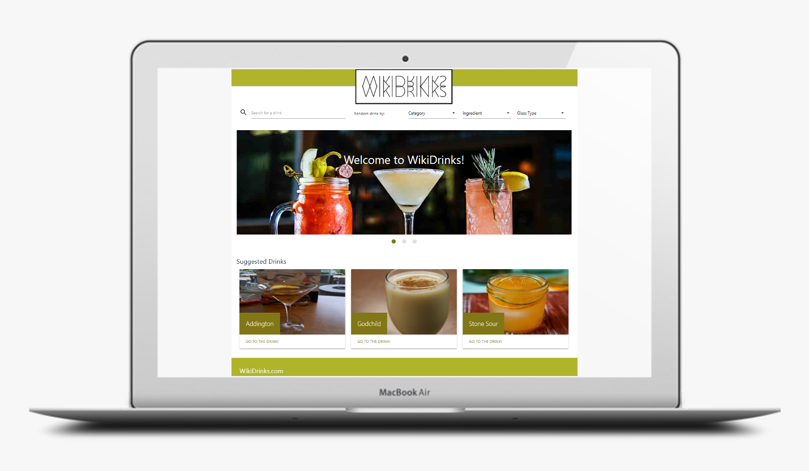

# WikiDrinks

WikiDrinks is a modern website that provide users the possibility to search for drinks, in order to obtain the indredients, measures, and preparation instructions. All within a funny and engaging user experience with gifs and drinks related articles.

## Elevator Pitch

WikiDrinks was designed for users over 18 years old, who want to have a nice drink at home or impress their guests. The WikiDrinks site is a modern website that provides ingredients, preparation instructions, and related articles for any given cocktail name, or provide random suggestions in a funny interactive way.

Unlike other boring cocktail books or target search in YouTube, WikiDrinks provides interesting suggestions by ingredient, category or glass type to make your selection much easier and preparation funnier animated with gifs.

## The Concept

**Motivation for development**
Due to the COVID-19 contingency, people cannot go out to get a nice drink with friends.

Therefore WikiDrinks provides a solution to users that have gotten bored of traditional drinks like beer or “cubitas” at home, and want to try something new with ingredients they can find at home or can easily buy online.

Having a fun time while making their own drinks and impressing their friends on social media with their drink’s pictures.

**User Stories**

- [x] As a user, I want to find a cocktail recipe for a specific drink, so that I can get the ingredients, measures and the instructions to prepare the drink.
- [x] As a user I want to get suggestions based on an ingredient I already have so that I can use it in my drink
- [x] As a user, I want to get a random cocktail suggestion, so that i can get a recipe when I don’t know what to drink
- [x] As a user, I want to see suggested article readings related to my drink selection

## The Process

**Technologies Applied**

Server-side APIs

- [The CocktailDB](https://www.thecocktaildb.com/)

- [Giphy](https://developers.giphy.com/)

- [New York Times](https://developer.nytimes.com/)

CSS framework

- [CSS Materialize](https://materializecss.com/)

Third-party API

- [Google’s Material Icons](https://google.github.io/material-design-icons/)

Other tools

- [Test CORS](https://www.test-cors.org/)
- [Markup Validation Service](https://validator.w3.org/)

**Tasks and Roles**

We defined the following roles:

- Front End - Rodrigo Rosas
- Back End - Raul Alarcón
- Project Management - Jorge Guzman

The developing process:

1. Brain storming to define the project main concept
2. Research the APIs, frameworks and CORS
3. Define the MVPs (Minimum Viable Prducts) and due dates
4. Define the roles
5. Create the mobile first and responsive version sketches
6. Code each of the MVPs (HTML, CSS and JS)
7. Daily stand-ups for status, adjustments, agreements and support
8. Ensure code proper practices
   - Coding standards
   - Semantic HTML
   - HTML validation

**Challenges**

- Research of different API’s and CSS frameworks options and reading documentation
- Learning a new CSS framework and integrating components
- The Cocktail DB API response, returned a single string for drink instructions
- To make it fun we wanted to add gifs describing the steps in instructions
- Our web site scope requires at least 15 API’s calls for each drink selection to fulfill all Cocktail details, ingredients pictures, instruction gifs and NYT articles.

**Successes**

- Collaborative execution and seamless integration
- Modern, mobile first and responsive UI
- Algorithm created to separate single string instructions in steps by identifying “.” and pushing to a new array.
- Most common verbs in instructions concentrated in a string, and compared to response from API to make target gifs search
- Function Factory: to simplify API calls and how response is reflected in the HTML while using and impacting local/global variables.

## The Result

**The WikiDrinks Website**

**Directions for Future Development**

Collaborative user interactions:

- User can contribute with recipes
- User can vote for drinks

User Experience:

- Segment users by preferences and suggest accordingly
- Link to User social media accounts
- Share recipes by email or social media

Web page sustainability:

- Sponsors can pay to appear in random suggestions
- Users can buy essential kits to make drinks

## Links to the application

The project was uploaded to [GitHub](https://github.com/) at the following repository:
[https://github.com/raul-ae/project-1](https://github.com/raul-ae/project-1)

You can access the deployed application with the GitHup Pages link:
[https://raul-ae.github.io/project-1/](https://raul-ae.github.io/project-1/)
